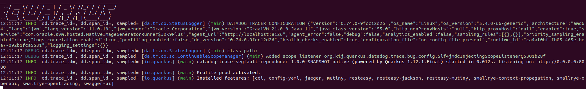

# datadog-trace-java-graalvm-segfault-reproducer

This is a small and simple REST web service running on Quarkus and GraalVM, using dd-trace-java OT library to send traces to a local datadog agent.

The purpose is to reproduce a segmentation fault error happening on datadog trace exporter when running on GraalVM.
This application expose two simple endpoints under /demo/request1 and /demo/request2

### Compiling the project

Requirements: 

Docker should be installed and correctly setup. Quarkus will use it to compile with GraalVM tools. You will also need it to run a local datadog agent for the tests.
You need at least docker to let quarkus run Graal tools as docker at compile time if you do not have GraalVM installed on your machine.

After downloading this project, compile it natively with the following command:

```
mvn compile -Pnative
```


### Running the application

##### 1. Run the local datadog agent

Replace the variables <YOUR_DATADOG_API_KEY_HERE> and <YOUR_LOCAL_HOSTNAME_HERE> by your own values

```
docker run -d --name dd-agent \
  -v /var/run/docker.sock:/var/run/docker.sock:ro \
  -v /proc/:/host/proc/:ro \
  -v /sys/fs/cgroup/:/host/sys/fs/cgroup:ro \
  -p 8126:8126/tcp \
  -p 8125:8125/udp \
  -e DD_API_KEY=<YOUR_DATADOG_API_KEY_HERE> \
  -e DD_DOGSTATSD_NON_LOCAL_TRAFFIC=true \
  -e DD_APM_ENABLED=true \
  -e DD_HOSTNAME=<YOUR_LOCAL_HOSTNAME_HERE> \
  -e DD_ENV=<YOUR_LOCAL_HOSTNAME_HERE> \
  -e NON_LOCAL_TRAFFIC=false \
  gcr.io/datadoghq/agent:latest
```

##### 2. Run the native version of the application

Execute the runner provided under the target folder of the project (after compiling in native mode)

```
./target/quarkus-datadog-trace-segfault-reproducer-1.0.0-SNAPSHOT-runner
```

You application should start and show the datadog configuration. 
You don't need any particular configuration as we are using the minimum for this demonstration.




### Executing the tests

You will have to run tests fast enough and in parallel to reproduce the segmentation fault error.

For this, either setup your own test, or use the provided ones with postman

##### Testing with postman

Load the test file located under 'src/test/resources'
Start a runner, with the following setup:
 - select the two tests
 - setup an iteration number of 1000
 - setup a delay of 0 ms
 
The segmentation fault should appear after a while. If it does not happen, launch again the same test configuration until you reproduce it.
